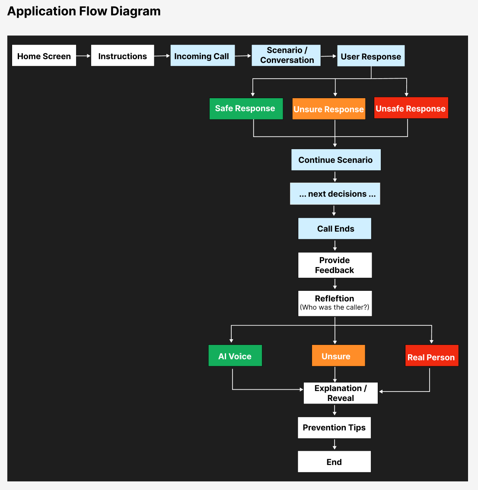

# Application Flow

The application flow shows the main user journey through the *Beat the Scammer* prototype. Users move through a simulated scam call, select responses, receive feedback, and complete a reflection activity before receiving prevention advice.

## Flow Description

**Home Screen**

The user starts the training activity from the home screen.

**Instructions**

The user receives instructions explaining the purpose of the activity and how to interact with the simulated call.

**Incoming Scam Call**

The application displays an incoming call screen to simulate receiving a suspicious phone call. The user can swipe to answer the call.

**Scenario / Conversation**

The user follows a simulated conversation with the caller. Pre-recorded audio is used to represent the caller, with different audio played for each stage of the conversation.

**User Response**

The user selects one of three responses using an on-screen button. Each response is categorised as **Safe**, **Unsure**, or **Unsafe** and determines the next part of the scenario.

**Safe / Unsure / Unsafe Response Path**

The selected response leads to the corresponding response path. The application provides feedback about the user's decision and continues the conversation through the next scenario stage. The scenario contains multiple decisions before the call ends.

**Call Ends**

After the final decision, the simulated call ends and the user proceeds to the feedback and reflection activities.

**Feedback**

The application provides feedback about the user's responses and explains relevant aspects of the scam scenario.

**Reflection**

The user is asked to consider whether the caller could be an AI impersonation scam. The reflection question is presented with three response options.

**Yes / Not Sure / No**

The user selects **Yes**, **Not sure**, or **No** to indicate whether they think the caller was an AI impersonation scam. Each selection produces corresponding feedback and audio.

**Explanation / Reveal**

The application reveals that the caller was an AI impersonation scam and explains the correct answer. It highlights relevant signs or behaviours that the user should consider in a similar situation.

**Prevention Tips**

The user receives practical advice for recognising and responding to AI voice impersonation scams.

**End**

The training activity finishes after the prevention information has been presented.
