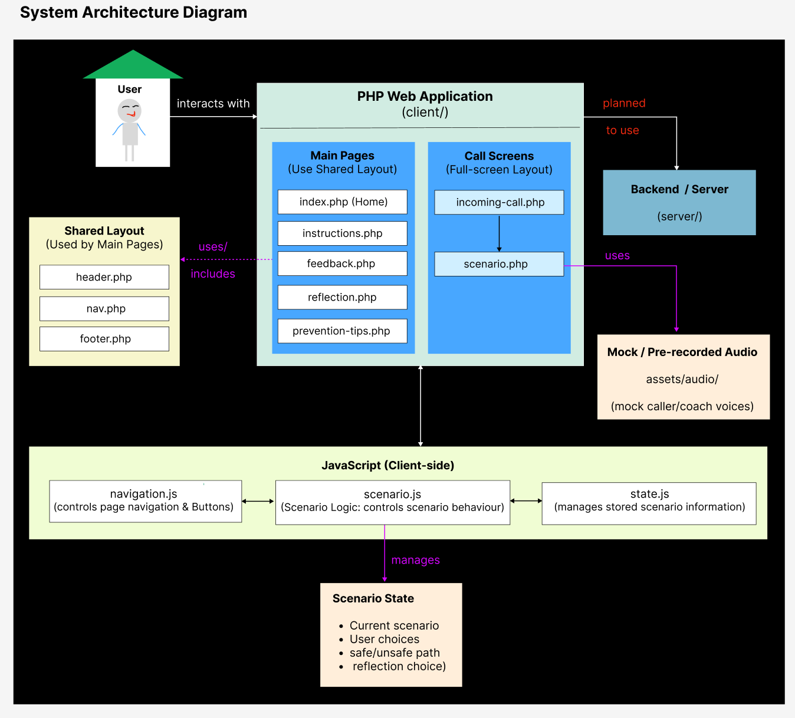

# System Architecture

The system architecture shows the main components of the *Beat the Scammer* prototype and how the PHP pages, JavaScript, shared layout, audio and future backend functionality work together.

## Main Components

### PHP Web Application

The PHP files provide the main screens of the prototype. They are divided into normal pages and call-related screens.

### Shared Layout

`header.php`, `nav.php` and `footer.php` provide reusable layout components for the main non-call pages.

The `incoming-call.php` and `scenario.php` screens use a separate full-screen layout to simulate a phone call.

### JavaScript

The JavaScript files provide client-side interaction.

* `navigation.js` manages navigation and button interactions.
* `scenario.js` manages scenario behaviour and response logic.
* `state.js` manages the current scenario state and user choices.

### Scenario State

The scenario state keeps track of information required during the activity, such as the current scenario, the user's response, the safe or unsafe path, and the reflection choice.

### Audio

Mock or pre-recorded audio is stored in `assets/audio/` and is used to simulate the caller's voice.

### Backend / Server

The `server/` directory has been prepared for backend functionality. The exact backend approach and functions will be determined during development and integrated with the front end where required.

### User Interaction

The overall interaction moves from the PHP pages to JavaScript-based scenario logic. The user's choices determine the safe or unsafe response path and later the AI voice or real person reflection path.
